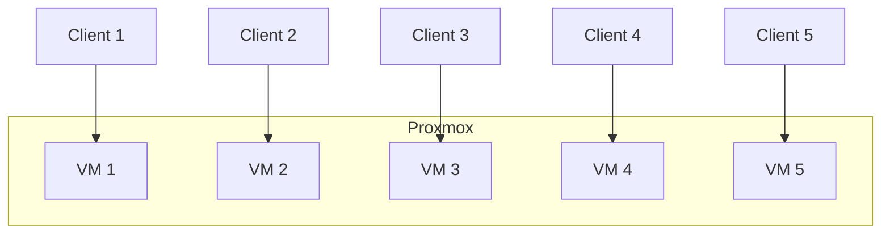
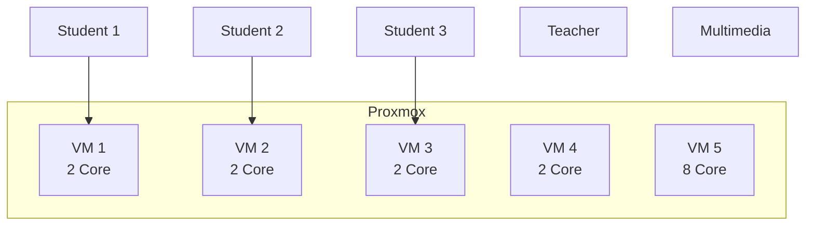
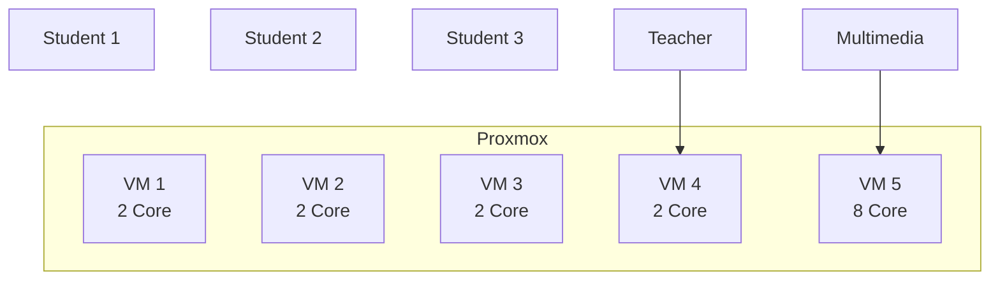

# Proposal server proxmox

## Problem

komputer lemot, diuji dengan membuka 2 tab youtube, 1 tab video tutorial, 1 tab lagu:

- Komputer sekolah: 1 menit 25 detik, [link video](https://youtube.com/shorts/LPXBA9O1mVw?feature=share)
- Simulasi proxmox: 32 detik, [link video](https://youtube.com/shorts/eW6Xy3i7Nbk?feature=share)

## Solution

proxmox, sebuah software yang dapat memvirtualisasi banyak komputer (virtual machine) dalam satu komputer.

### Prediksi harga untuk 16 virtual komputer:
| Komponen | Jumlah | Harga Satuan | Total Harga | Link |
|------------------|--------|--------------|-------------|--------------|
| Case | 1 | Rp 528.0000| Rp 528.000| [Link](https://www.tokopedia.com/enterkomputer/antec-nx200m-matx-gaming-case-left-side-glass-door-free-1-pcs-12cm-fan-1729625054865754704) |
| PSU 650W | 1 | Rp 625.000| Rp 625.000| [Link](https://www.tokopedia.com/enterkomputer/1stplayer-ack-series-650w-ha-650ac1-80-certified-with-embossed-cable-active-pfc-psu-650-watt-1730822508688934876) |
| CPU cooler | 1 | Rp 431.000 | Rp 431.000 | [Link](https://www.tokopedia.com/enterkomputer/deepcool-ak400-white-lga1700-support) |
| Motherboard Asus PRIME B850M-A wifi | 1 | Rp 2.960.000 | Rp 2.960.000 | [Link](https://www.tokopedia.com/enterkomputer/asus-prime-b850m-a-wifi-csm-am5-amd-b850-ddr5-usb3-2-type-c-sata3-1731912530498324048) |
| Storage NVME PCIe Gen5 2TB | 1 | Rp 3.299.000 | Rp 3.299.000 | [Link](https://www.tokopedia.com/enterkomputer/adata-xpg-mars-980-pro-2tb-pcie-gen5-x4-ssd-2tb-1731695090766743120) |
| Ryzen 9 7900X | 1 | Rp 6.509.000 | Rp 6.509.000 | [Link](https://www.tokopedia.com/enterkomputer/amd-ryzen-9-7900x-4-7ghz-up-to-5-6ghz-cache-64mb-am5-box-12-core) |
| RAM DDR5 32GB | 4 | Rp 1.448.000 | Rp 5.792.000 | [Link](https://www.tokopedia.com/enterkomputer/crucial-ddr5-pc44800-5600mhz-32gb-1x32gb-ct32g56c46u5-ram-32gb-1731520635660830288?extParam=src%3Dshop%26whid%3D53830&aff_unique_id=&channel=others&chain_key=) |
| Pengiriman | 1 | Rp 315.000 | Rp 315.000 |  |
| **Total** | | | **Rp 20.459.000** | |

### Prediksi harga untuk 9 virtual komputer:
| Komponen | Jumlah | Harga Satuan | Total Harga | Link |
|------------------|--------|--------------|-------------|--------------|
| Case | 1 | Rp 528.0000| Rp 528.000| [Link](https://www.tokopedia.com/enterkomputer/antec-nx200m-matx-gaming-case-left-side-glass-door-free-1-pcs-12cm-fan-1729625054865754704) |
| PSU 650W | 1 | Rp 625.000| Rp 625.000| [Link](https://www.tokopedia.com/enterkomputer/1stplayer-ack-series-650w-ha-650ac1-80-certified-with-embossed-cable-active-pfc-psu-650-watt-1730822508688934876) |
| CPU cooler | 1 | Rp 431.000 | Rp 431.000 | [Link](https://www.tokopedia.com/enterkomputer/deepcool-ak400-white-lga1700-support) |
| Motherboard Asus PRIME B850M-A wifi | 1 | Rp 2.960.000 | Rp 2.960.000 | [Link](https://www.tokopedia.com/enterkomputer/asus-prime-b850m-a-wifi-csm-am5-amd-b850-ddr5-usb3-2-type-c-sata3-1731912530498324048) |
| Storage NVME PCIe Gen5 1TB | 1 | Rp 1.855.000 | Rp 1.855.000 | [Link](https://www.tokopedia.com/enterkomputer/msi-spatium-m560-1tb-m-2-nvme-pcie-gen5-x4-ssd-1tb-1731318177511147088) |
| Ryzen 7 7700X | 1 | Rp 5.559.000 | Rp 5.559.000 | [Link](https://www.tokopedia.com/enterkomputer/amd-ryzen-7-7700x-4-5ghz-up-to-5-4ghz-cache-32mb-am5-box-8-core) |
| RAM DDR5 32GB | 3 | Rp 1.448.000 | Rp 4.344.000 | [Link](https://www.tokopedia.com/enterkomputer/crucial-ddr5-pc44800-5600mhz-32gb-1x32gb-ct32g56c46u5-ram-32gb-1731520635660830288?extParam=src%3Dshop%26whid%3D53830&aff_unique_id=&channel=others&chain_key=) |
| Pengiriman | 1 | Rp 315.000 | Rp 315.000 |  |
| **Total** | | | **Rp 16.617.000** | |

## Benefits

- Harga lebih murah dibanding beli 25 komputer baru
- Multifungsi, bisa buat self hosting (may need more money and effort)
- Upgradabillity, menggunakan socket AM5 hingga bisa upgrade CPU keluaran 2027 (di proposal keluaran 2022)
- Fleksibilitas, dapat menambah VM untuk guru atau staff lainnya

**Saat labkom sedang dipake murid :**

**Saat labkom sedang tidak dipake :**

## Comparison
### Proxmox
- Pros
  - Harga murah, sekitar Rp 20.459.000 untuk 16 virtual komputer, Rp 16.617.000 untuk 9 virtual komputer
  - Upgradable, dapat upgrade CPU hingga keluaran 2027
  - Fleksibel, dapat menambah VM untuk guru atau staff lainnya

- Cons
  - Konfigurasi rumit untuk pembuatan VM baru
  - Ada step tambahan dimana anak-anak/admin perlu menghubungkan client dan VM
  
### Beli 25 komputer baru
- Pros
  - Lebih mudah, tinggal beli dan pasang
  - Tidak perlu maintenance software
- Cons
  - Harga mahal, sekitar Rp 53.425.000, [referensi komputer](https://www.tokopedia.com/tokohone/komputer-pc-all-in-one-komputer-ultra-tipis-lenovo-komputer-all-in-one-dengan-layar-definisi-tinggi-prosesor-intel-core-i3-i5-i7-16g-1tb-cocok-untuk-kantor-belajar-bekerja-bermain-game-garansi-6-tahun-1731270552600479301) (ini pake cpu keluaran 2012)
  - Upgrade tidak banyak opsi, karena keluaran CPU sudah lam

### Aster
- Pros
  - Lebih mudah, tinggal beli dan pasang
  - Tidak perlu maintenance software
- Cons
  - Harga 24.030.000 untuk 12 orang, pak lantang pernah nanya
  - Tidak fleksibel, jumlah orang terbatas
  - Rentan error saat ada banyak murid yang menggunakan, mouse digerakin di komputer A malah gerak di komputer B